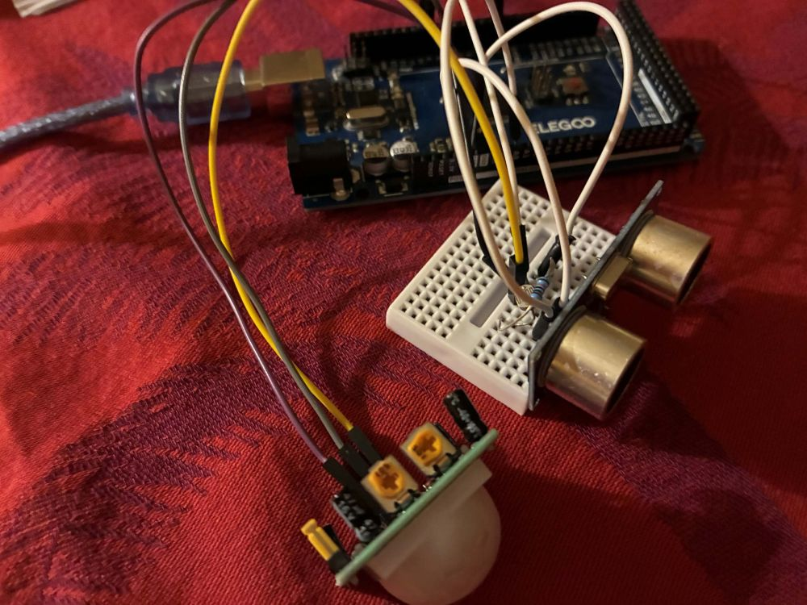

# 自由研究

**問題意識：センサーを組み合わせることで、どのようにデメリットを補い合えるか**

## 研究手法

1. 各センサーの長所と短所を調べる
2. 組み合わせを決める
3. それぞれの組み合わせに合わせた検証をする
4. それぞれの組み合わせに合わせた実験をする
5. 結果を出す

## STEP1 長所と短所を調べる

**超音波距離センサー**

超音波を発信して、受信するまでの時間で計算する↓

*距離＝½×発信から受信までの距離×音速*

長所

* 透明なものでも検出できる
* 複雑な物体も検出できる
* 測定範囲が大きい
* ホコリや水に強い
* 距離が測れる

短所

* 発信・受信をするものの表面にホコリが付くと精度が落ちる
* 光に比べて応答速度が遅い
* 精度が低い（環境によって誤差が生じやすい）
* 人と物が区別できない

**PIRセンサー（受動型赤外線センサー）**

内部に二つの焦電素子があり、人間が動くと片方の素子だけに熱が当たるので動いたとわかる。

長所

* 高感度
* 環境にあまり左右されない
* 消費電流が少ない

短所

* 止まっている人は検知できない
* 動物にも反応する

**光センサー（LDR）**

受け取る光の量に基づいて抵抗が変化する。光が LDR の表面に当たると、CdS 内で電子がたくさんでき、電流が流れやすくなり、抵抗が減る。

長所

* 高感度
* 環境にあまり左右されない
* 消費電流が少ない

短所

* 特定の地域でCdSの利用が制限されている
* 物体はわからない
* 精密ではない
* 早く変化する光は検出できない

**GY-521**

GY-521はMPU6050を基板化したモジュール。MPU6050は3軸加速度センサー と 3軸角速度センサーを一つにまとめたもの。

長所

* 多機能
* 高精度
* 消費電流が少ない

短所

* データの補正が必要
* 角度を求めるのに積分する必要がある

**温湿度センサー**

温湿度センサーは、静電容量型と電気抵抗型と熱伝導式があり、静電容量型は向かい合った電極に高分子膜が挟まれていて（片方は空気中の水分を透過する電極）、高分子膜に水分がつくと、静電容量が増えるのでこの変化を測定する。電気抵抗型は、くし型の電極が接触しないように設置され、間には高分子材料が挟まれているが、電極が接触していないため、水分がついていない状態では抵抗が大きくなり、逆に水分がつくと抵抗が小さくなる。熱伝導式は空気の熱伝導率の変化から絶対湿度を測定する。

長所

* 静電容量型：応答が速い
* 静電容量型：低い湿度の範囲で計測ができる
* 電気抵抗型：ノイズに強い
* 電気抵抗型：小型化ができる
* 熱伝導式：相対湿度ではなく絶対湿度を測定できる
* 熱伝導式：精度が高い

短所

* 静電容量型：ノイズ対策が必要
* 静電容量型：相対湿度しか計測できない
* 電気抵抗型：応答が遅い
* 電気抵抗型：精度が低い
* 熱伝導式：専門的・産業的用途に限定される
* 熱伝導式：コストが高い

## STEP2 組み合わせを決める

||||
|-|-|-|
|組み合わせ|決定|理由|
|超音波＋人感＋光|✅|この組み合わせが一番欠点を補え合えそうで、人と物の動きや明るさの区別ができるから|
|超音波＋人感＋GY-521||人感センサーに角度や加速度の情報が付くと精度が上がるのかが知りたかったから|
|超音波＋光＋温湿度||この3つのセンサーを使って生活環境の良し悪しを計れることができるかと思ったから。|
|超音波＋水位＋温度||水の蒸発の条件を調べることができるかと思ったから|
|超音波＋温湿度||超音波センサーに温湿度の情報が加わると、超音波センサーの値はどのように変わるかを知りたかったから|
|超音波＋GY-521||超音波センサーに角度や加速度の情報が付くと精度が上がるのかが知りたかったから|

## STEP3 仮説

超音波は距離(の変化)はわかるが人と物を区別できない、人感は動いている人を検知できるが止まっている人を検知できない、光は明るさだけしかわからない

<small>装置の画像</small>

## STEP4 実験1　各センサーの働きを検証する

||||||
|-|-|-|-|-|
||距離設計|超音波(0.5秒ずつ)|人感|光|
|何もなし|---|400.00 cm|OFF|860\~880|
|歩く|1.2→0.8m|121.15 cm  108.04 cm  103.77 cm  95.99 cm  88.79 cm  85.63 cm  75.03 cm|ON|860\~880|
|止まる|0.8m|10回の平均:  78.217 cm  最長: 83.90  最短：73.83|OFF|860\~880|
|物が動く|||OFF|860\~880|
|箱を置く|0.5m|48.03\~52.48|OFF|860\~880|
|消灯|---|400.00 cm|OFF|380～400|

**超音波+人感+光STEP 5判定ルールを作る**

人が動いた判定

* 超音波センサーの測定距離が 200cm未満 で変動し、人感センサーが ON の場合

物が動いた判定

* 超音波センサーの測定距離が 200cm未満 で変動し、人感センサーが OFF の場合

止まっている人と止まっている物判定

* 超音波センサーの測定距離が 200cm未満 でほぼ変動せず、 人感センサーが OFF の場合

消灯判定

* 光センサーの値が前回測定時より 急に150以上減少した場合

## STEP6 実験2　判定制度を測定

|||||||
|-|-|-|-|-|-|
|状態|距離設計|超音波|人感|光|判定|
|歩く|1.2→0.8m|119.3,  121.6,  114.3,  99.0,  85.9|ON,  ON,  ON,  ON,  ON|284,  309,  303,  278,  275|人が近付いた判定|
|物が動く|1→0.5m|97.9,  85.1,  71.0,  58.3,  46.0|OFF,  OFF,  OFF,  OFF,  OFF|285,  284,  285,  285,  285,|物が動いた判定|
|止まる|0.8m|76.02～82.91|ON|284～285|止まっている人と止まっている物判定|
|箱を置く|0.5m|43.73～54.10|OFF|284～285|止まっている人と止まっている物判定|
|消灯|---|400.00|OFF|140～162|消灯判定|

# STEP7 まとめ

この研究の目的は、センサーを融合するとどのように欠点を補えてどのようなことができるかで、実験で超音波センサーと人感センサーが実際にそれぞれの欠点（人と物の区別）を補い合っていて、そこに光センサーを加えることで明るさまでわかるようになっていました。この組み合わせはロボットなどに使えると思います。

超音波、人感、光センサーなどのセンサーについて詳しく調べて知ることができて、そして実際に使ってみて誤差などの修正が難しかったですが、特徴や問題点などを計測することができました。誤差には止まっている人を物体と誤判定、人感センサーがすぐOFFになる、超音波センサーから直線上の距離にたっていないと反応しないなどでした。なのでセンサーから得た情報の組み合わせが重要だと思います。

AIのような現在の技術を使えば、複数の人や座っている人、屋内と屋外、人か物が横切った場合などさらに多くのことが判定できるようになると思います。いつかそれもやってみたいです。

